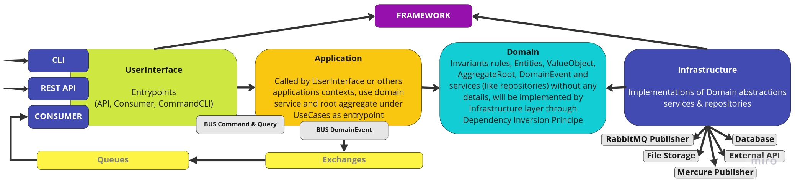

# Clean Architecture with Symfony 6.1 / ApiPlatform 3.0

## Implementation study of CleanArchitecture through the must elegant way with using PHP Symfony & ApiPlatform

### Introduction
After months of looking at articles about Clean Architecture, I couldn't find an example implementation that was comprehensive enough or elegant enough (often sloppy or violates the concepts).

This project is as a [Kata](https://fr.wikipedia.org/wiki/Kata_(programmation)) to study implementation of Clean Architecture in PHP project with using Symfony & ApiPlatform framework.

No need yet lot of features, this is just a [Kata](https://fr.wikipedia.org/wiki/Kata_(programmation)) for find the most elegant way to realize it.

### Project tree structure
I choose to organize my folders as contexts which contains all layers of clean architecture. Popular other alternative is to have all layers on root.

#### Contexts structure
Actually we have a **Messaging** context (manage conversations, messages & conversations participants) and contexts **User**, **Workspace** and **Authentication**. **Common** context contains class used by other contexts.

#### Layers structure

##### UserInterface
Represents the entry points of the application, it can be a REST API Controller, a Consumer, a CLI Command etc...

##### Application
This is a border between **UserInterface** layer and **Domain** layer.

It must be the guarantor of the isolation of the domain to which it belongs by never returning an entity but structured data which has no behavior.

Communication is done through message buses. (MessageBus: Command & Query)

He contains the UseCases (**Interactor**) implemented as Handler of MessageBus with for each Command or Query (**InputPort**) and return DTO or nothing (**OutputPort**).

##### Domain
Most important of all, this layer is the representation of the business, defined the invariants (set of rules engraved in marble) which ensures the consistency of the code with the business and should be readable enough to be understood by a person who knows the business, but without necessarily any background or technical knowledge. Only the Application layer is authorized to manipulate its objects.

###### Entity
This is a DomainObject, a structure with methods to apply operation on himself or on theirs aggregates with control of correct business rules applied.

These entities are often a representation in object of datatable and in this project, is currently managed by Doctrine ORM.

###### AggregateRoot
This is an entrypoint to process operation on Entities of a domain. In each domain we have an Aggregate Root and the others entities are aggregate of these.

###### ValueObject
This is a domain object which encapsulate business rules but should stay immuable.

###### Repository
Repository is an interface for be used by Application layer as abstraction and respect rules that domain layer should not see implementation details helped with concept of dependency inversion.

##### Infrastructure
This layer is responsible for implementing the abstractions of domain services and repositories by implementing their interfaces. These implementations or concrete classes will be injected via the principle of dependency inversion. This layer makes the link with all the external services (Database, Partner API, File storage, Asynchronous message publication, Send mail, ...)

### Install project

`make install`

### Launch project

`make start`

### Local project url

`api.lab-ddd.localhost`

### Quality

Actually with too refactorings, I don't think it the time to implement quality tools but will be implemented in futur.

- Writing functional tests with control of OpenAPI specifications
- Add deptrack control to ensure that layers rules dependencies aren't violated.
- Add PHP static analyzer.
- Add workflow to operate check of previous installed tools on each pull request.
- ...
